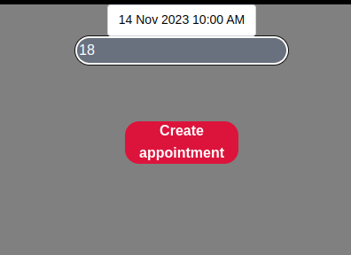

# Welcome to my frontend app  

<div>
    <p align="center">
  
</p>
<div>
<br></br>
<div>
<a href = "antonioinsa@tutanota.com"></a>
<a href="https://www.linkedin.com/in/antonioinsa/" target="_blank"></a> 
</p>
</div>
<br></br>
<details>
  <summary>Contenido 📝</summary>
  <ol>
    <li><a href="#objetivo-🎯">Objetivo</a></li>
    <li><a href="#sobre-el-proyecto-🔎">Sobre el proyecto</a></li>
    <li><a href="#stack">Stack</a></li>
    <li><a href="#instalación-en-local">Instalación</a></li>
    <li><a href="#vistas">Vistas</a></li>
    <li><a href="#futuras-funcionalidades">Futuras funcionalidades</a></li>
    <li><a href="#licencia">Licencia</a></li>
  </ol>
</details>

## Objetivo 🎯
Este proyecto requería conexión a una API funcional y usar react para crear una web.

## Sobre el proyecto 🔎
En este proyecto, se ha realizado la maquetación del proyecto anterior (backend Estudio de tatuajes).
Se puede observar, sin estar registrado, a los tatuadores y sus creaciones.
Si desea registrarse, puede crear, actualizar y eliminar citas propias de cada cliente, al igual que consultar todas sus citas con su/s tatuador/es.
Por parte de los trabajadores, pueden actualizar el precio de sus propias citas con sus diferentes clientes y pueden visualizar todas las citas que tienen con los diferentes clientes.
Por parte del SuperAdmin, se puede consultar todas las citas tomadas por los clientes y todos los datos de los clientes en detalle.
    

## Stack
<div align="center">
<a href="https://www.reactjs.com/">
    
</a>
<a href="https://developer.mozilla.org/es/docs/Web/JavaScript">
    
</a>
 </div>

## Instalación en local
1. Clonar el repositorio
2. ` $ npm install `
3. ``` $ npm run dev ```

## Vistas
Home
  
Tattoo artist 

Tattoo galery 

Login

Login Workers

Register

Profile (client)

Create appoinment 

Update date appointment 

Edit profile client
<div>


</div>
Profile (worker)

Profile (superAdmin)

SuperAdmin can view all clients 


## Futuras funcionalidades
✅ Al hacer clic en cada tatuador, se deben mostrar sus trabajos.

✅ Filtrar por tipo de intervención.

✅ Aplicar mayor seguridad.

✅ Insertar mensajes de error en la base de datos para que sean más precisos.


## Licencia
Proyecto desarrollado por Antonio Insa Benavent, bajo licencia MIT.

Consulta el archivo <a href="./LICENSE">`LICENSE`</a> para más información.